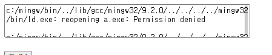

# spawn으로 구축하기
이 경우 한 곳에서 컴파일러를 쓰고 있으면 다른 컴에서 컴파일러를 사용하지 못하는 문제 발생(permission denied)  
-> 결국 docker container를 이용해야 함
<br>


## spawn을 이용한 c 컴파일 예제
```javascript
const debug = require('debug')('cbuild_controller');
const fs = require('fs');
const spawn = require('child_process').spawn;
//const bodyParser = require('body-parser');

exports.build = (req, res, next) => {
    var code = req.body.code;   // client에서 보낸 코드
    const source = code.split(/\r\n|\r\n/).join("\n");    // 개행 처리
    var errData = '';
    const date = Date.now();
    const file = date + '.c';
    var removeFileList = [];

    // 파일로 코드 저장
    fs.writeFile(file,source,'utf8',function(error) {
        debug("make file: " + file);
    });

    // gcc를 이용해 compile
    var compile = spawn('gcc',[file]);
    compile.stdout.on('data', (data) => {
        debug("stdout: " + data);
    });
    compile.stderr.on('data', (data) => {
        debug("stderr: " + data);
        errData += String(data);
    });

    // 결과 값 받기(프로세스 종료)
    compile.on('close', (code) => {
        // code == 0은 process 정상 종료
        if(code == 0) {
            // 컴파일 결과 나온 실행파일을 실행시켜 나오는 결과값을 전달
            var run = spawn('./a.exe',[]);
            run.stdout.on('data', (data) => { 
                var responseData = {'result':'ok','output': data.toString('utf8')};
                res.json(responseData);
            });
            run.stderr.on('data', (data) => {
                console.log(String(data));
            });
            run.on('close', (code) => {
                debug("compile process exited with code ${code}")
            });
            removeFileList.push(file, 'a.exe');
        }
        else{
            var responseData = {'result': 'error', 'output':errData.toString('utf-8')};
            res.json(responseData);
            debug("run Process Error");
            removeFileList.push(file);
        }

        // 무조건 파일 제거
        var remove = spawn('rm', removeFileList);
        remove.stdout.on('data', (data) => { 
            debug("rm stdout: " + data)
        });
        remove.stderr.on('data', (data) => {
            debug("rm stderr: " + String(data))
        });
        remove.on('close', (code) => {
            if(code == 0)
                debug("Success: " + file + " removed")
            else
                debug("Err: remove process");
        });
    });
}

exports.test = (req, res, next) => {
    return res.status(200).send('Arrived');
}
```
<br><br>

# Dockerode 이용하기
docker container를 이용할 수 있는 모듈인 dockerode를 이용한다.  
<br>

## C build
1. 서버에 C 코드 파일 생성
2. gcc 포함된 docker container를 띄움(이때 host의 c 코드 파일을 container로 매핑시켜야함)
3. container에서 컴파일 하고 결과를 return
4. container는 일을 마치고 바로 제거됨
[컴파일에러 파일 출력](https://kldp.org/node/1742)
<br>

### 출력 결과 받기
```
결과가 출력은 되나 container 내부에서 출력되는게 서버 log에 뜨는듯?
이를 client에 보내려면 cotainer 내부의 표준출력을 가져와야 한다.
즉 '>'를 이용해 파일로 저장한다.
```
<br>

# k8s 배포
## create namespace

```docker
# namespace 없을 경우
k create namespace ns-buildnode
```
<br>

## docker images push

```bash
docker build -t build-node .
docker tag build-node wlgh325/build-node:0.1
docker push wlgh325/build-node:0.1
```
<br>

# [buildnode deploy](../../k8s/node/buildnode-deploy.yaml)
# [buildnode pvc](../../k8s/node/buildnode-pv.yaml)
# [buildnode ingress](../../k8s/nginx-ingress/buildnode-ingress.yaml)