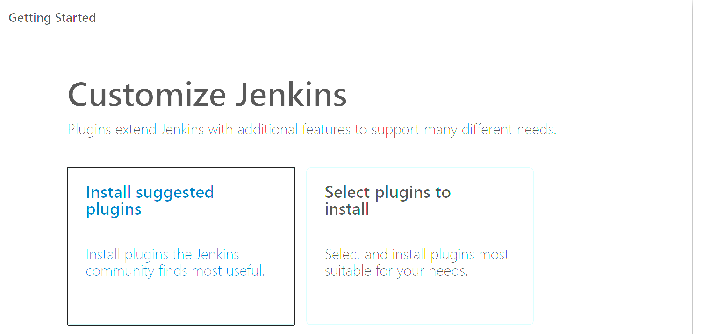
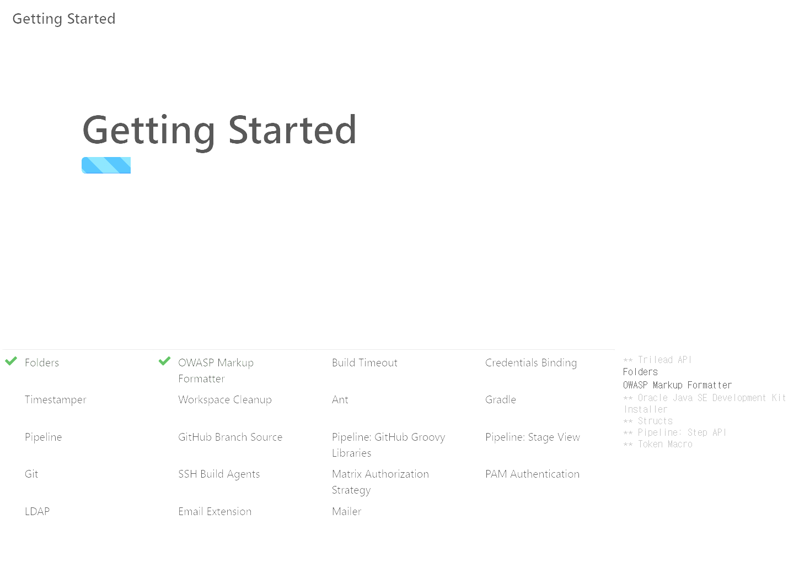
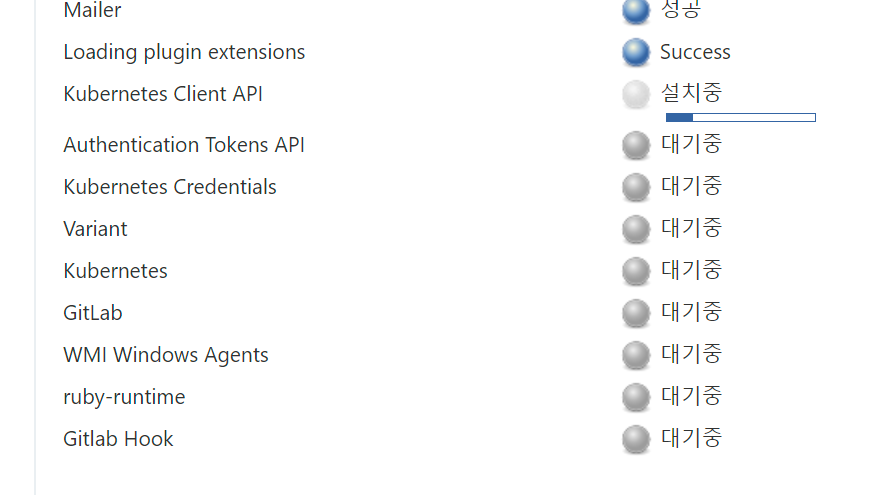

# Jenkins 구동 과정

- k8s cluster에 ns-jenkins namespace 생성
- jenkins-sa-clusteradmin-rbac.yaml 파일로 ServiceAccount 생성, cluster-admin role 부여
- default 계정에도 cluster-admin role 부여
<br>

# Jenkins 구동

## Namespace, serviceAccount, ClusterRoleBinding

```bash
$ k create namespace ns-jenkins
$ cd s03p31a110/k8s && mkdir jenkins && cd jenkins
$ vim jenkins-sa-clusteradmin-rbac.yaml
```
<br>

## serviceAccoount 및 clusterrolebinding

```yaml
# jenkins-sa-clusteradmin-rbac.yaml
apiVersion: v1
kind: ServiceAccount
metadata:
  namespace: ns-jenkins
  name: jenkins

---

kind: ClusterRoleBinding
apiVersion: rbac.authorization.k8s.io/v1
metadata:
  name: cluster-admin-clusterrolebinding
subjects:
- kind: ServiceAccount
  name: jenkins
  namespace: ns-jenkins
roleRef:
  apiGroup: rbac.authorization.k8s.io
  kind: ClusterRole
  name: cluster-admin

---

kind: ClusterRoleBinding
apiVersion: rbac.authorization.k8s.io/v1
metadata:
  name: cluster-admin-clusterrolebinding-2
subjects:
- kind: ServiceAccount
  name: default
  namespace: ns-jenkins
roleRef:
  apiGroup: rbac.authorization.k8s.io
  kind: ClusterRole
  name: cluster-admin
```
<br>

## jenkins deployment 및 구동

서울시간 설정 참고

[https://medium.com/hgmin/jenkins-docker-timezone-3bb80efad3d4](https://medium.com/hgmin/jenkins-docker-timezone-3bb80efad3d4)

[https://kubernetes.io/ko/docs/tasks/inject-data-application/define-environment-variable-container/](https://kubernetes.io/ko/docs/tasks/inject-data-application/define-environment-variable-container/)

```yaml
# jenkins-deploy.yaml
apiVersion: apps/v1
kind: Deployment
metadata:
  name: jenkins-leader
  namespace: ns-jenkins
spec:
  replicas: 1
  selector:
    matchLabels:
      app: jenkins-leader
  template:
    metadata:
      labels:
        app: jenkins-leader
    spec:
      serviceAccountName: jenkins
      securityContext: # Jenkins uid:gid=1000:1000
        fsGroup: 1000
      containers:
      - name: jenkins-leader
        image: jenkins/jenkins:alpine
        volumeMounts:
        - name: jenkins-home
          mountPath: /var/jenkins_home # container path
        ports:
        - containerPort: 8080
        - containerPort: 50000
        env:
        - name: TZ
          value: "Asia/Seoul"
      volumes:
      - name: jenkins-home
        persistentVolumeClaim:
          claimName: jenkins-leader-pv-claim
      nodeSelector:
        kubernetes.io/hostname: ip-172-26-7-12

--- 
apiVersion: v1
kind: Service
metadata:
  name: jenkins-leader-svc
  namespace: ns-jenkins
  labels:
    app: jenkins-leader
spec:
  type: NodePort
  ports:
  - port: 80
    targetPort: 8080
    protocol: TCP
    name: http
    nodePort: 30000
  - port: 50000
    protocol: TCP
    name: slave
    nodePort: 30001
  selector:
    app: jenkins-leader
```
<br>

## jenkins-leader-pv

```yaml
# jenkins-leader-pv.yaml
apiVersion: v1
kind: PersistentVolume
metadata:
  name: jenkins-leader-pv-volume
  labels:
    location: local
    type: jenkins
sepc:
  storageClassName: manual
  capacity:
    storage: 10Gi
  accesNodes:
    - ReadWriteMany
  hostPath:
    path: "/home/ubuntu/k8s/jenkins/jenkins-home"

---
apiVersion: v1
kind: PersistentVolumeClaim
metadata:
  name: jenkins-leader-pv-claim
spec:
  storageClassName: manual
  accessNodes:
    - ReadWriteMany
  resources:
    requests:
      storage: 10Gi
  selector:
    matchLabels:
      location: local
      type: jenkins
```
<br>

# 실행

```bash
$ k apply -f jenkins-sa-clusteradmin-rbac.yaml
$ chown -R 1000:1000 /home/ubuntu/k8s/jenkins/jenkins-home
$ k apply -f jenkins-leader-pv.yaml
$ k apply -f jenkins-deploy.yaml
$ kg pod --all-namespaces -o wide
```
<br>

## 안되면 다음 체크

```bash
# error 확인
$ k describe pod jenkins-leader-id -n=ns-jenkins
```
<br>

# Jenkins WebPage 접속 및 jenkins 설치
jenkins Nodeport로 접속한다. (url:30000)
<br>

## 암호 확인

```bash
$ kg pod -n ns-jenkins
$ k exec -it [jenkins pod id] cat /var/jenkins_home/secrets/initialAdminPassword -n ns-jenkins
```

## 정상적으로 입력 후 화면 전환

- Install suggested plugins 클릭하여 추천 플러그인 설치
<br>



- admin 유저 생성
- jenkins URL 설정
<br>

# jenkins 환경설정 & plugin
- Jenkins관리 - Configure Global Security에서 TCP port for inbound agents를 50000으로 맞춤
- prevent Cross Request Forgery explits 체크 해제
- Apply & save
<br>

# 플러그인 관리
- jenkins 관리 - 플러그인 관리
- 검색하여 kubernetes, Gitlab, Gitlab Hook 선택하고 지금 다운로드하고 재시작후 설치하기 선택


<br>

# 시스템 설정
```
# of executors 수를 2에서 0으로 변경
이는 동시에 배포 가능한 스레드 수. 0으로 설정하여 동시에 여러개 배포 되지 않도록 함
```

## cloud 설정
### 쿠버네티스 설정 입력
- name: kubernetes
- kubernetes URL: https://kubernetes.default.svc.cluster.local
- disalbe https certificate check: yes
- kubernetes Namespace: ns-jenkins(jenkins 서비스를 구동시킨 namespace)
- jenkins URL: http://jenkins-leader-svc.ns-jenkins.svc.cluster.local
- jenkins tunnel: jenkins-leader-svc.ns-jenkins.svc.cluster.local:50000
<br>

### credential 설정
- credentials-jenkins 선택
- Kind: kubernetes Service account
- secret text 선택 후 Test connection
- 정상적으로 연결되면 apply & save
<br>

# Jenkins pipeline Test
- 새로운 Item 생성, pipeline 클릭
- 테스트 파이프라인 스크립트 작성
```bash
    echo 'Hello world'
```
<br>
- build now 버튼을 통한 빌드
- 콘솔 출력확인(Console Output)