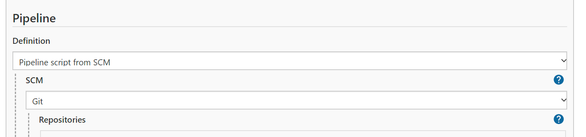
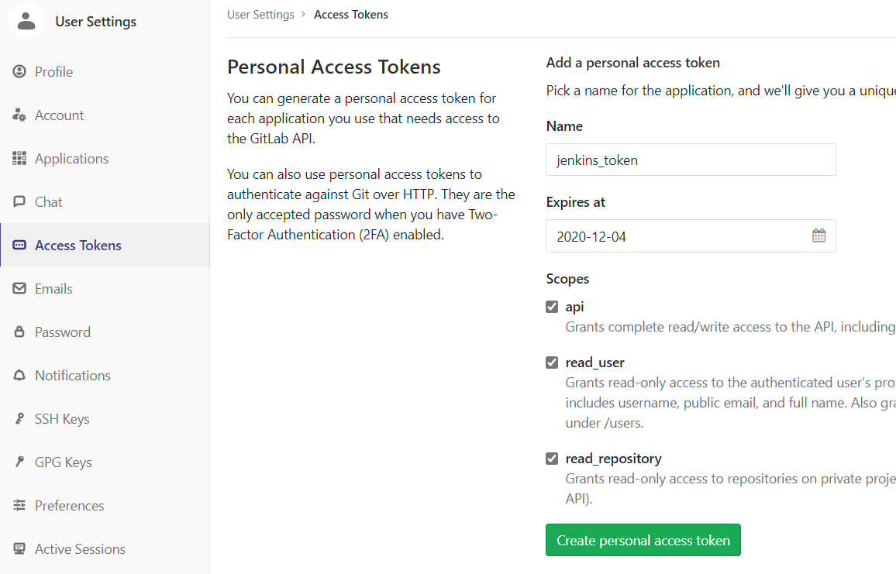
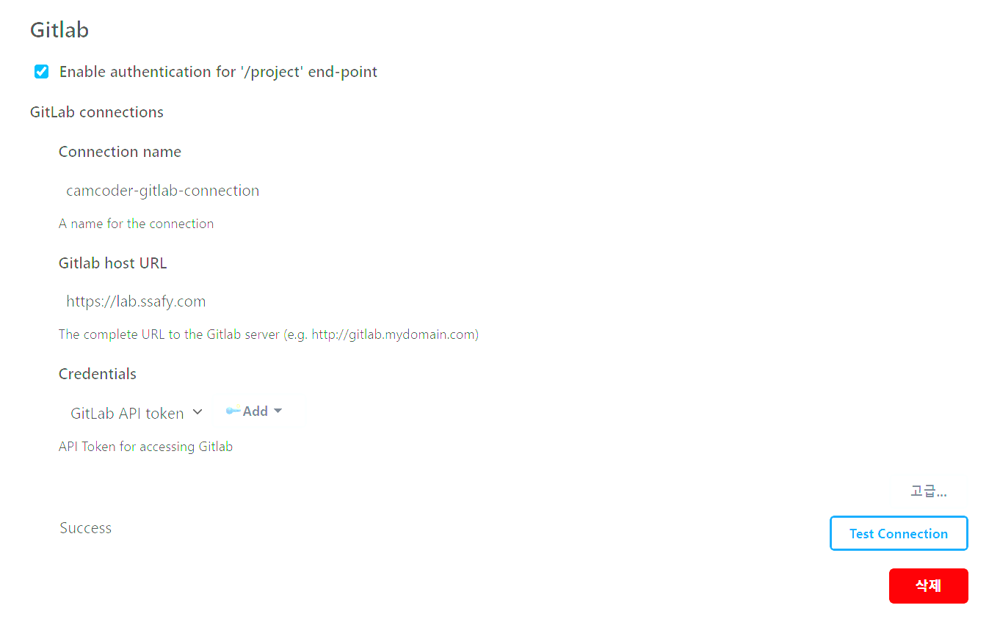
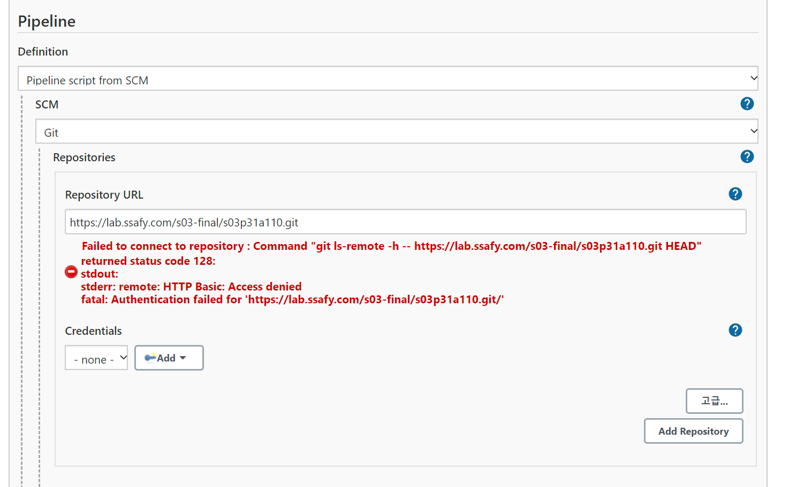
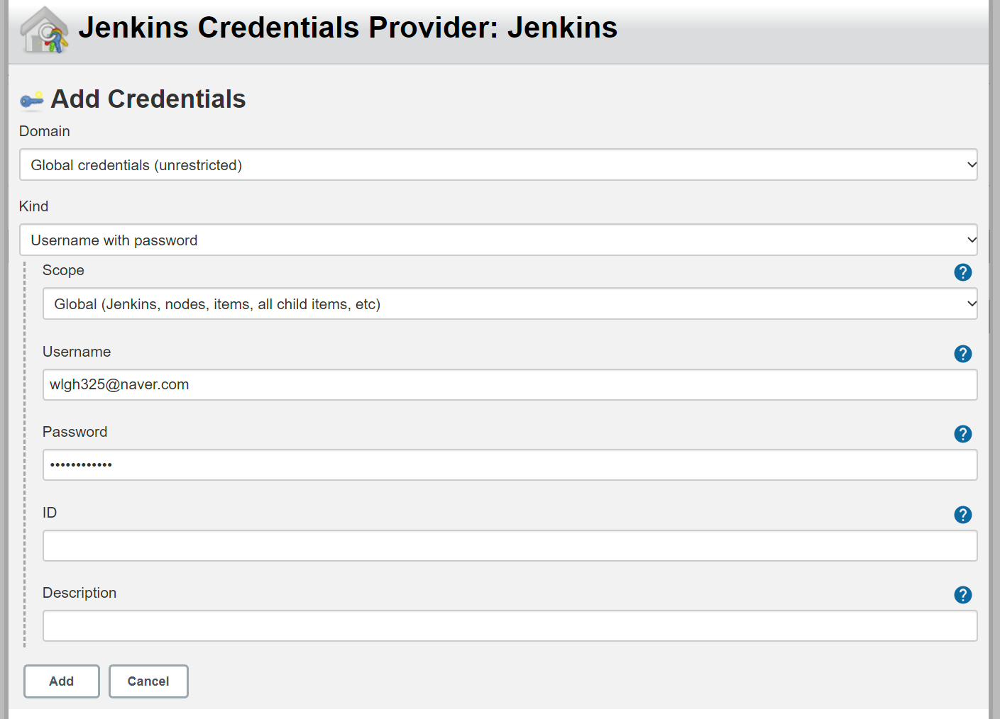
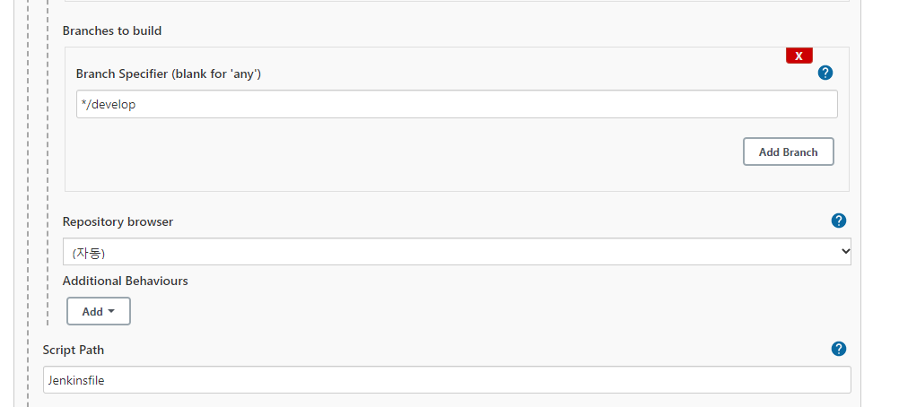

- Gitlab repo를 생성하고 로컬과 연동을 마친다.

# Jenkins 파이프라인 생성

- 파이프라인을 생성하고 Definition을 Pipeline script for SCM으로 변경한다
- SCM을 git으로 선택하고 repo 주소를 입력한다.

# Jenkins 시스템 설정
- Gitlab User Setting로 가서 Access tokens 발급 받기
- Create token을 누르면 토큰이 나오는데 이를 메모장에 복사 해놓는다.

 

## jenkins 설정에 gitlab 정보 입력
다음과 같이 connection name은 임의로 입력하고
gitlab host URL: [https://lab.ssafy.com](https://gitlab.com) 으로 작성한다. ( 보통은 https://gitlab.com 으로 작성하는 듯)
그리고 credentials에서 add를 누른다

- 좀전에 발급 받은 token 정보를 입력한다
- kind를 GItLab API token으로 변경한다.
- token 값과 id 입력한다.
- Test connection -> success 성공
 

## jenkins pipeline 설정
- gitlab의 https clone url을 복사한다.
- 아까 생성한 pipeline의 구성으로 들어간다
- repo ULR에 붙여 넣는다. 아직 credential이 추가되지 않아 error 발생

- credential ADD를 누르고 gitlab ID와 비번 입력. 그러면 에러가 사라지게 된다.

- 아래에 script Path도 작성한다 (Jenkinsfile)
- 빌드할 브랜치르 지정, Jenkins Script 지정
