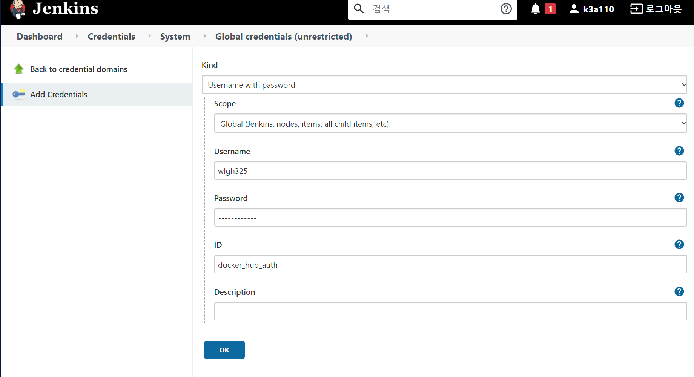
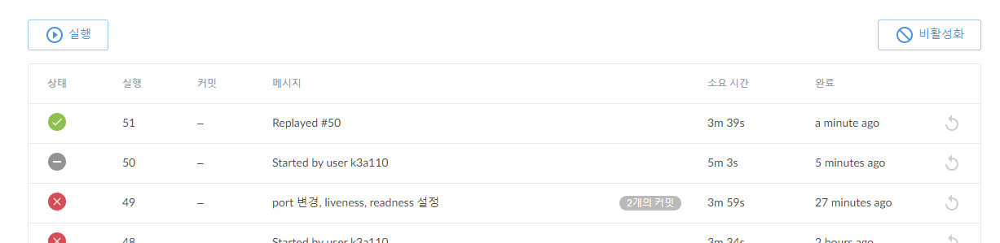

## Jenkinsfile 작성

이 파일은 Jenkins pipeline이 실행되면, 각 소스에 존재하는 Jenkinfile에 정의되어 있는 Step에 맞춰서 빌드/배포가 진행된다.

즉, Springboot를 빌드/배포하기 위해 각 프로젝트별로 Jenkinsfile이 필요하다.

podTemplate 정의 참고

[https://www.jenkins.io/doc/pipeline/steps/kubernetes/#podtemplate-define-a-podtemplate-to-use-in-the-kubernetes-plugin](https://www.jenkins.io/doc/pipeline/steps/kubernetes/#podtemplate-define-a-podtemplate-to-use-in-the-kubernetes-plugin)

혹시나 수정사항이 안바뀐다면 jenkins pod을 다시 띄운다.

```groovy
/* pipeline 변수 설정 */
def DOCKER_IMAGE_NAME = "wlgh325/project-camcoder"
def DOCKER_IMAGE_TAGS = "0.4"
def NAMESPACE = "camcoder-project"
def VERSION = "${env.BUILD_NUMBER}"
def DEPLOY_NAME = "camcoder-spring"
def HELM_CHART_DIR = "springboot"
def MM_CHANNEL = "push_10"
def ICON = "https://jenkins.io/images/logos/jenkins/jenkins.png"
def DATE = new Date();

def notifyStarted(mm_channel, icon) {
	mattermostSend(color: "#33C7FF", icon: "${icon}", channel: "${mm_channel}", message: "STARTED: Job '${env.JOB_NAME} [${env.BUILD_NUMBER}]' (${env.BUILD_URL})")
}

def notifySuccessful(mm_channel, icon) {
	mattermostSend(color: "#39FF33", icon: "${icon}", channel: "${mm_channel}", message: "SUCCESSFUL: Job '${env.JOB_NAME} [${env.BUILD_NUMBER}]' (${env.BUILD_URL})")
}

def notifyFailed(mm_channel, icon) {
	mattermostSend(color: "#FF4C33", icon: "${icon}", channel: "${mm_channel}", message: "FAILED: Job '${env.JOB_NAME} [${env.BUILD_NUMBER}]' (${env.BUILD_URL})")
}

podTemplate(label: 'builder',
			containers: [
				containerTemplate(name: 'maven', image: 'maven:3.6-jdk-11-slim', command: 'cat', ttyEnabled: true),
				containerTemplate(name: 'docker', image: 'docker', command: 'cat', ttyEnabled: true),
				containerTemplate(name: 'kubectl', image: 'lachlanevenson/k8s-kubectl:v1.15.3', command: 'cat', ttyEnabled: true),
				containerTemplate(name: 'helm', image: 'dtzar/helm-kubectl', command: 'cat', ttyEnabled: true)
			],
			volumes: [
				hostPathVolume(mountPath: '/home/env', hostPath: '/home/ubuntu/env'),
				hostPathVolume(mountPath: '/var/run/docker.sock', hostPath: '/var/run/docker.sock')
			]) {
	node('builder') {
		try{
			stage('Start'){
				notifyStarted(MM_CHANNEL, ICON)	
			}
			stage('Checkout') {
				checkout scm
			}
			stage('Build') {
				container('maven') {
					dir('backend/tmp_crud/camcoder'){
						sh "mvn clean package"
					}
				}
			}
			stage('Docker build') {
				container('docker') {
					withCredentials([usernamePassword(
						credentialsId: 'docker_hub_auth',
						usernameVariable: 'USERNAME',
						passwordVariable: 'PASSWORD')]) {
							dir('backend/tmp_crud/camcoder'){
								sh "docker build -t ${DOCKER_IMAGE_NAME}:${DOCKER_IMAGE_TAGS} ."
								sh "docker login -u ${USERNAME} -p ${PASSWORD}"
								sh "docker push ${DOCKER_IMAGE_NAME}:${DOCKER_IMAGE_TAGS}"
							}
						}
				}
			}
			stage('Clean up current deployments'){
				container('helm') {
					try{
						sh "helm delete ${DEPLOY_NAME} -n ${NAMESPACE}"
                        sh "sleep 20"
					}
					catch (e) {
						echo "Clear-up Error: " + e.getMessage()
						echo "Continue Process !"
					}
				}
			}
			stage('deploy to cluster') {
				container('helm') {
					withCredentials([usernamePassword(
						credentialsId: 'docker_hub_auth',
						usernameVariable: 'USERNAME',
						passwordVariable: 'PASSWORD')]) {
							sh "kubectl get ns ${NAMESPACE} || kubectl create ns ${NAMESPACE}"

							sh """
								kubectl get secret my-secret -n ${NAMESPACE} || \
								kubectl create secret docker-registry my-secret \
								--docker-server=https://index.docker.io/v1/ \
								--docker-username=${USERNAME} \
								--docker-password=${PASSWORD} \
								--docker-email=wlgh325@gmail.com \
								-n ${NAMESPACE}
							"""
                            
                            //sh "echo ${DATE}"
                            //sh "sed -i.bak 's$DATE_STRING#${DATE}#' ./k8s/k8s-deployment.yaml

							dir('helm'){
								echo "Install with chart file !"
								sh "helm install ${DEPLOY_NAME} ${HELM_CHART_DIR} --namespace ${NAMESPACE}"
							}
						}
				}
			}
			notifySuccessful(MM_CHANNEL, ICON)
		} catch(e) {
			currentBuild.result = "FAILED"
			notifyFailed(MM_CHANNEL, ICON)
		}
	}
}

```
<br>

# Jenkins credentialsid 추가(docker hub credential)
Jenkins 관리 - Manage Credentials - Stores scoped to Jenkins의 Jenkins Store 클릭 
— Sytem의 Global credentials(unrestricted) 클릭
— Add credentials 클릭

<br>

# helm
기존에 진행했던 helm을 가지고 진행한다.
이미지 이름을 바꿔준다.(서비스 포트도)
<br>

# Docker hub

docker hub 가입과 컨테이너 생성도 진행해준다.
private으로 했는데 이 경우 왠지 stage에서 진행시 거부되서
다시 public으로 바꿔서 성공
<br>

# Build now
수동빌드를 통해 제대로 작동하는지 확인한다.
<br>

# 성공
