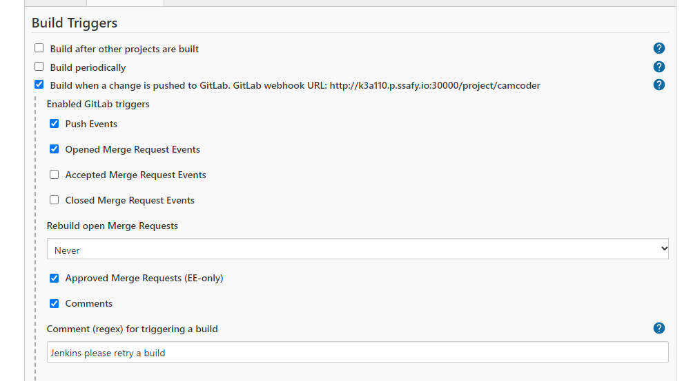
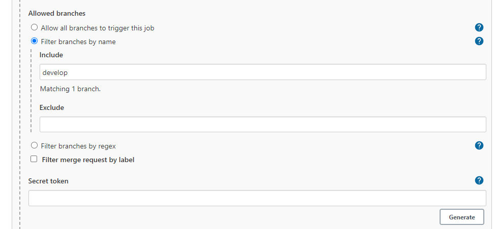
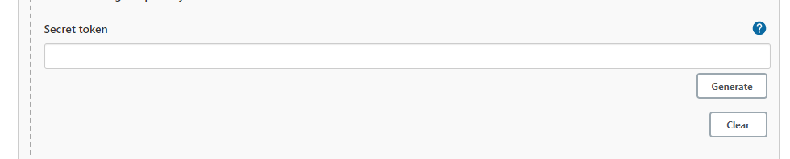
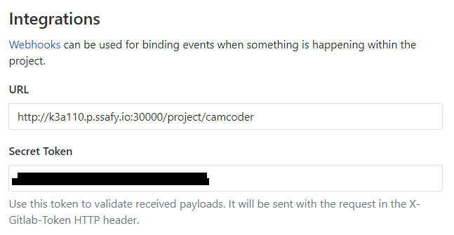
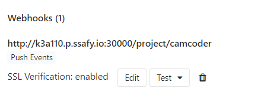

gitlab webhook plugin을 먼저 설치한다

# Jenkins webhook 설정

   

# 고급 설정
포함시킬 branch 설정. develop branch를 추가하였다.
 

   

# token 생성
  
secret token 아래의 Generate 버튼을 클릭하여 token을 생성한다.  
그러면 자동으로 생성된다.  
이는 Gitlab의 webhook에 등록하여 사용할 것이다.
   

# gitlab webhook 설정
secret token 아래의 Generate 버튼을 클릭하여 token을 생성한다.  
그러면 자동으로 생성된다.  
이는 Gitlab의 webhook에 등록하여 사용할 것이다.  
   

# webhook 추가
- add webhook 버튼 클릭 -> webhook 등록
   
- Test-> push events 클릭
   