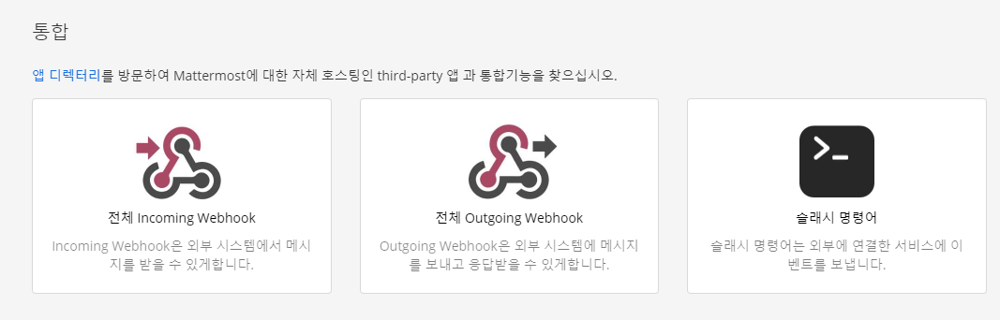

# mattermost
통합기능 -> Incoming webhook 클릭
 
   

- incoming webhook이 있으면 webhook URL 사용하고 없으면 만든다
   

# mattermost notification 플러그인 설치
plugin 매니저에서 설치한다
   

## global mattermost notifier 설정
- jenkins 관리 - 시스템 설정으로 들어가 맨 밑으로 내림
- Endpoint: mattermost webhook URL
- channel: 채널 이름
- build server URL: jenkins URL
   
- Test Connection -> success

# Jenkinsfile 수정
참고 사이트
- [https://plugins.jenkins.io/slack/](https://plugins.jenkins.io/slack/)
- [jenkins.io/doc/pipeline/steps/mattermost/](http://jenkins.io/doc/pipeline/steps/mattermost/)
- [https://stackoverflow.com/questions/53712149/how-to-send-mattermost-notifications-in-jenkins-using-groovy](https://stackoverflow.com/questions/53712149/how-to-send-mattermost-notifications-in-jenkins-using-groovy)