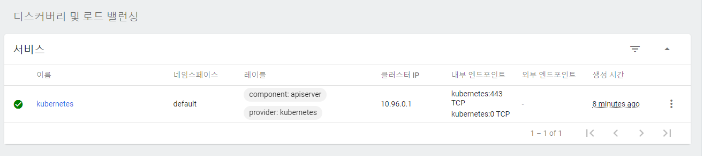

# 신뢰할 수 있는 APT 키 추가

```bash
$ sudo apt install apt-transport-https
$ curl -s https://packages.cloud.google.com/apt/doc/apt-key.gpg | sudo apt-key add
```
<br>

# Repository 추가 및 k8s설치

```bash
$ echo "deb https://apt.kubernetes.io/ kubernetes-xenial main" | sudo tee -a /etc/apt/sources.list.d/kubernetes.list
$ sudo apt update
$ sudo apt install kubelet kubeadm kubectl kubernetes-cni -y
```
<br>

# 마스터 노드 초기화

Kubernetes가 성공적으로 설치 되었을 경우, 가정 먼저 수행해 주실 내용은 Master 노드를 초기화 해야한다.

pod network를 무엇을 쓰냐에 따라 초기화 코드가 다르다

여기서는 flannel을 이용한다.
<br>

## IPv4 트래픽을 iptables 체인으로 전달

```bash
$ sudo sysctl -w net.bridge.bridge-nf-call-iptables=1
$ sudo sysctl -w net.ipv4.ip_forward=1
```
<br>

## master node 초기화

```bash
$ sudo kubeadm init --pod-network-cidr=10.244.0.0/16
```
<br>

## 클러스터 설정 파일 복사

```bash
mkdir -p $HOME/.kube
sudo cp -i /etc/kubernetes/admin.conf $HOME/.kube/config
sudo chown $(id -u):$(id -g) $HOME/.kube/config
```
<br>

# Pod network 추가

마스터 노드가 초기화 되었으니 Pod 간의 통신을 위해 Pod 네트워크 추가

```bash
sudo kubectl apply -f https://raw.githubusercontent.com/coreos/flannel/master/Documentation/kube-flannel.yml
```
<br>

## 클러스터 노드 정보확인

```bash
$ kubectl get nodes
```
<br>

# 대시보드 UI 배포

```bash
kubectl apply -f https://raw.githubusercontent.com/kubernetes/dashboard/v2.0.0/aio/deploy/recommended.yaml
```
<br>

## dashboard 실행 상태 확인

```bash
kubectl get pods --all-namespaces
```
<br>

## 세부정보 확인 가능

```bash
kubectl -n kubernetes-dashboard get service kubernetes-dashboard
```
<br>

## Dashboard 가동 방법

- Proxy를 이용하는 방법
- NodePort를 이용하는 방법
- API Server를 이용하는방법

[https://waspro.tistory.com/516](https://waspro.tistory.com/516)
<br>

## API Server 이용

### client certificate와 client key 추출

kubecfg.crt와 kubecfg.key 파일 생성

```bash
grep 'client-certificate-data' ~/.kube/config | head -n 1 | awk '{print $2}' | base64 -d >> kubecfg.crt
cat kubecfg.crt

grep 'client-key-data' ~/.kube/config | head -n 1 | awk '{print $2}' | base64 -d >> kubecfg.key
cat kubecfg.key
```
<br>

### p12 인증서 생성

```bash
openssl pkcs12 -export -clcerts -inkey kubecfg.key -in kubecfg.crt -out kubecfg.p12 -name "kubernetes-admin"
ls -al kubecfg.p12 # 생성 확인
```
<br>

### 인증서 다운

```bash
kubecfg.p12
/etc/kubernetes/pki/ca.crt 파일 로컬로 복사
```
<br>

### 인증서 적용(window, 관리자 권한 실행)

```bash
certutil.exe -addstore "Root" C:\Users\Guest1\Desktop\cam-coder\ca.crt
certutil.exe -p [PW] -user -importPFX C:\Users\Guest1\Desktop\cam-coder\kubecfg.p12
```
<br>

## 토큰 발급

```bash
kubectl -n kube-system describe $(kubectl -n kube-system \
    get secret -n kube-system -o name | grep namespace) | grep token
```
<br>

# kubernetes-dashboard 접속 방법

[https://k3a110.p.ssafy.io:6443/api/v1/namespaces/kubernetes-dashboard/services/https:kubernetes-dashboard:/proxy/#/login](https://k3a110.p.ssafy.io:6443/api/v1/namespaces/kubernetes-dashboard/services/https:kubernetes-dashboard:/proxy/#/login)

## kubernetes-dashboard 페이지 접속

API 서버를 이용하여 접속한다.
<br>

## 토큰 발급

```bash
$ kubectl -n kube-system describe secret $(kubectl -n kube-system get secret | grep admin-user | awk '{print $1}')
```
<br>

## 발급 받은 토큰으로 dashboard 접속

## 신뢰할 수 있는 APT 키 추가

```bash
$ sudo apt install apt-transport-https
$ curl -s https://packages.cloud.google.com/apt/doc/apt-key.gpg | sudo apt-key add
```
<br>

## alias 설정

```bash
alias k='kubectl'
```
<br>

# 쿠버네티스 자동완성

```bash
source <(kubectl completion bash)
echo "source <(kubectl completion bash)" >> ~/.bashrc

echo 'alias k=kubectl' >>~/.bashrc # alias 등록
echo 'alias kg=kubectl get' >>~/.bashrc # alias 등록
echo 'complete -F __start_kubectl k' >>~/.bashrc # alias k에 대해서도 자동완성
```
<br>