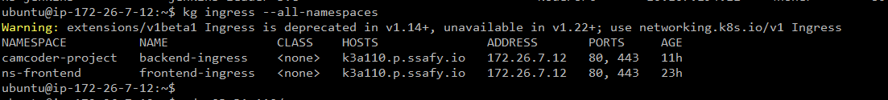

[https://cla9.tistory.com/94](https://cla9.tistory.com/94)

# metalLB 설치
```bash
kubectl apply -f https://raw.githubusercontent.com/metallb/metallb/v0.9.3/manifests/namespace.yaml
```

```bash
kubectl apply -f https://raw.githubusercontent.com/metallb/metallb/v0.9.3/manifests/metallb.yaml
```

```bash
kubectl create secret generic -n metallb-system memberlist --from-literal=secretkey="$(openssl rand -base64 128)"
```
<br>

# configMap 설정
```bash
apiVersion: v1
kind: ConfigMap
metadata:
  namespace: metallb-system
  name: config
data:
  config: |
    address-pools:
    - name: default
      protocol: layer2
      addresses:
      - 172.26.7.12-172.26.7.12
```


<br>

## mtealLB config 안 먹는 경우

- [참고 사이트](https://github.com/metallb/metallb/issues/348#issuecomment-442218138)

```bash
k delete po -n metallb-system --all
k apply -f config.yaml
```