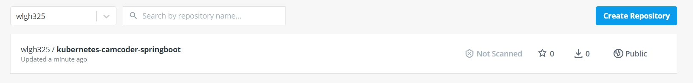

### 참고사이트
- [https://donghoon-khan.github.io/devops/web/deploy-spring-boot-application-on-kubernetes/](https://donghoon-khan.github.io/devops/web/deploy-spring-boot-application-on-kubernetes/)
- [https://jhooq.com/building-first-helm-chart-with-spring-boot/](https://jhooq.com/building-first-helm-chart-with-spring-boot/)
- [https://www.baeldung.com/kubernetes-helm](https://www.baeldung.com/kubernetes-helm)

# Containerize

## maven 설치

```bash
sudo apt-get install maven -y
mvn -v # 설치 확인
```
<br>

## maven build

pom.xml이 있는 곳에서 아래 명령어 실행으로 jar 파일 생성

```bash
mvn package
```
<br>

## Dockerfile 작성

java 11로 빌드

[https://stackoverflow.com/questions/53669151/java-11-application-as-lightweight-docker-image](https://stackoverflow.com/questions/53669151/java-11-application-as-lightweight-docker-image)

```bash
FROM alpine:latest as packager

RUN apk --no-cache add openjdk11-jdk openjdk11-jmods

ENV JAVA_MINIMAL="/opt/java-minimal"

# build minimal JRE
RUN /usr/lib/jvm/java-11-openjdk/bin/jlink \
    --verbose \
    --add-modules \
        java.base,java.sql,java.naming,java.desktop,java.management,java.security.jgss,java.instrument \
    --compress 2 --strip-debug --no-header-files --no-man-pages \
    --release-info="add:IMPLEMENTOR=radistao:IMPLEMENTOR_VERSION=radistao_JRE" \
    --output "$JAVA_MINIMAL"

FROM alpine:latest

ENV JAVA_HOME=/opt/java-minimal
ENV PATH="$PATH:$JAVA_HOME/bin"

# Add a volume to /tmp
VOLUME /tmp

# Make port 8080 available to the world outside this container
EXPOSE 8080

COPY --from=packager "$JAVA_HOME" "$JAVA_HOME"
COPY target/camcoder-0.0.1-SNAPSHOT.jar /app/app.jar

# Run the jar file
ENTRYPOINT ["java","-Djava.security.egd=file:/dev/./urandom","-jar","/app/app.jar"]
```
<br>

## Docker 빌드

```bash
$ docker build -t wlgh325/kubernetes-camcoder-springboot:0.1 .
```
<br>

## Docker push

```bash
$ docker login --username=${DOCKER_REGISTRY_USER_NAME}
$ docker push wlgh325/kubernetes-camcoder-springboot:0.1
# docker push [username]/[repository]:tagname
```

<br>

## Docker hub 확인

<br>

# 쿠버네티스 배포

helm을 이용해 배포한다.

## helm 차트 생성

```bash
$ helm create springboot
```

## helm chart 구조 확인

```bash
$ sudo apt-get install tree
$ tree springboot
```

## Chart.yaml

이 파일은 Helm Chart에 대한 모든 메타데이터를 담고 있다.

```bash
1apiVersion: v2 #mandatory
2name: springboot #mandatory
3description: A Helm chart for Kubernetes
4type: application
5version: 0.1.0 #mandatory
6appVersion: 1.16.0
```

1,2,3번은 무조건 필요함

## values.yaml

repository 와 port를 바꿔준다.

## deployment.yaml

ports: containerPort: 8080으로 변경

## Run helm template springboot

```bash
$ helm template springboot
```

주의할점은 springboot 폴더 밖에서 실행한다.

그러면 실제 값들이 들어간 yaml 파일을 만들어 준다.

## helm lint springboot

run 하기 전에 lint 검사를 한다.

이도 springboot 폴더 밖에서 진행한다.

```bash
$ helm lint springboot
```

## helm -debug -dry-run

마지막으로 install 하기전 configuration을 테스트 한다.

```bash
$ helm install camcoder-spring --debug --dry-run springboot
```
<br>

## helm install

```bash
$ helm install camcoder-spring springboot
```
<br>

## helm 확인

<br>

## k8s 확인
```bash
$ kg all
```
<br>

## 에러 나서 몇가지 변경

- deployment.yaml의 image 부분 코드를 변경한다. 왠지 tag가 인식이 안된다.

```yaml
image: "{{ .Values.image.repository }}"
```

- values.yaml 변경

```yaml
image:
  repository: wlgh325/kubernetes-camcoder-springboot:demo
  tag: ""
```
<br>

## curl 테스트

```yaml
$ curl 10.100.57.1:8080/
```

```yaml
$ curl ${NODE_IP}:30711
```