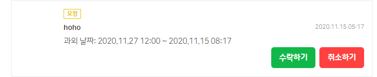
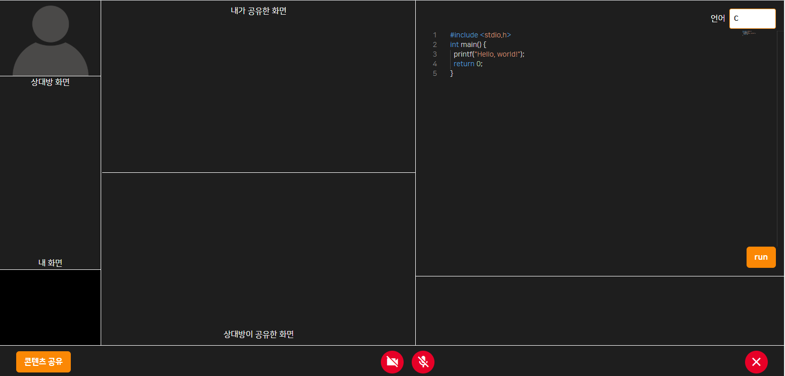
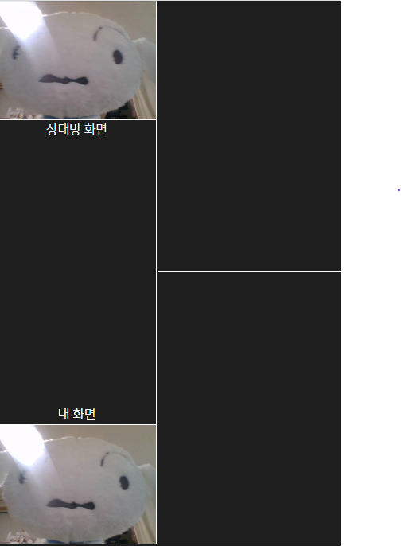
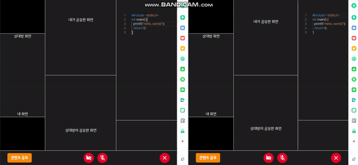
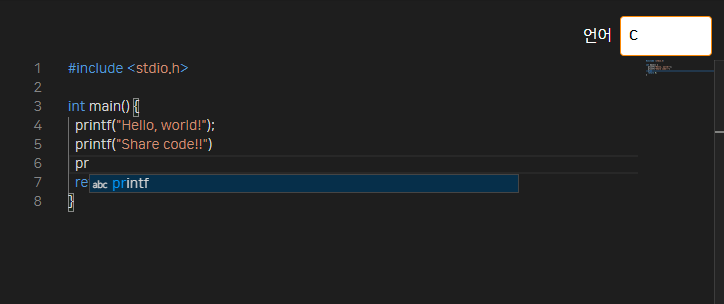
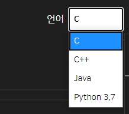

# 기능소개
## 공통
- [쪽지 보내기](./img/func1_sendMsg.png)  

## 학생
- [선생님 찜하기](./img/func2_likeTeacher.png)   
- [선생님 찾기](./img/func2_findTeacher.png)  
- [선생님 등록하기](./img/func2_enrollTeacher.png)   
- [과외 신청하기](./img/func2_submit.png)  
- [리뷰 작성](./img/func2_writeReview.png)  

## 선생님
- 과외 수락하기  
  

## 1대1 화상 과외
- 실시간 1대1 과외  

   

- 실시간 화상 캠  
     

- 코드 실시간 공유  
   

- visual studio code editor  
     

- 실시간 코드 빌드 및 출력 값 확인  
     

- C, C++, java, python 지원  
     